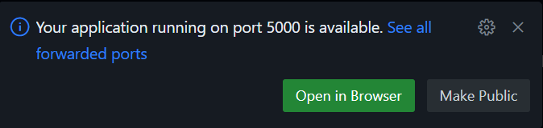

# ImplicitAssociationTest

https://implicit.harvard.edu/implicit/user/agg/blindspot/indexrk.htm

### Block Order & Significance:

Block 1 of 7: Dolphins to left, sharks to right

Block 2 of 7: Unpleasant to left, pleasant to right

Block 3 of 7: Dolphins and unpleasant to left, sharks and positive to right

Block 4 of 7: Same as block 3

Block 5 of 7: Sharks to the left, dolphins to the right

Block 6 of 7: Sharks and unpleasant to left, dolphins and positive to right

Block 7 of 7:  Same as block 6

### Setup Instructions

1. Have participants sign in to (or sign up for) GitHub. Share the link to this page with them.
2. Direct participants to the green `<> Code` button and have them click on it.
3. In the meny that pops up, have participants click on the `+` next to `Codespaces`. The Codespace will take some time to load.
4. Once it is done loading, click in the terminal.
    >Click on the box next to the dollar sign on the line where it says

    ``@<username> →/workspaces/ImplicitAssociationTest (main) $``
5. Paste the following: `pip install flask`
6. Once the terminal is done working, paste the following: `python app.py`

    >A pop-up may appear asking if you want to download the Python extension or something, just close the pop-up.

7. A pop up should appear saying the following. Click `Open in Browser`.

The Implicit Association Test should now be open and ready for use. Enjoy.